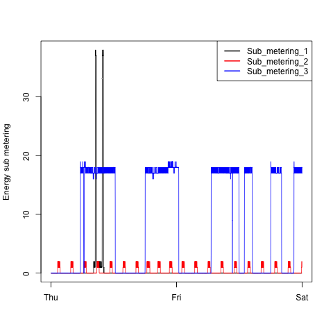

# Plotting assignment 1 - Exploratory Data Analysis
All scripts runs as is. The `load_data()` function loads the data provided it is in a directory called `data`.

## My plots

### Plot 1

### Plot 2

### Plot 3

### Plot 4

